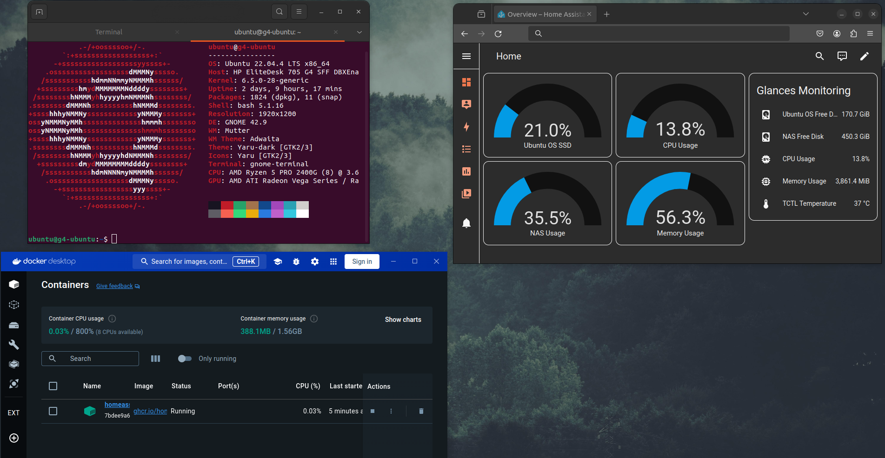

<h1 align="center">Home Lab</h1>
<h3 align="center">A home lab environment I created to explore diverse projects.</h3>
 

  

&nbsp;

<h2 align = "center">Home Lab Information</h2> 
<h3 align="left">Home Lab Configuration:</h3>
<ul>
    <li>
Server: HP EliteDesk 705 G4
</li>
    <li>
Specs: AMD Ryzen 5 PRO 2400G • 8GB DDR4 • 1x 256GB SSD • 1x 75GB HDD 
</li>
    <li>
Operating System: Ubuntu LTS 22.04
</li>
    <li>
Server Roles: Docker Host • Python Script Host • Backup Server • Network-Attached Storage (NAS) • Home Assistant Host
</li>
</ul>

&nbsp;

<h2 align = "center">Docker</h2> 
<h3 align="left">Docker Information:</h3>
<ul>
    <li>
Docker Containers: Home Assistant • yt-dlp Web Server
</li>
    <li>
Home Assistant Role: Control smart devices • Monitor home lab system information
</li>
    <li>
yt-dlp Web Server Role: Download Youtube videos on any local device by accessing yt-dlp web server.
</li>
    <li>
Implementations: Docker containers are scheduled to run on system startup to start Home Assistant and yt-dlp Web Server services.
</li>
</ul>

&nbsp;

<h2 align = "center">Python Scripts</h2> 
<h3 align="left">Python Scripts Information:</h3>
<ul>
    <li>
Python Scripts: yt-dlp Youtube Video Auto-Downloader • Social Media Web Scraper
</li>
    <li>
yt-dlp Youtube Video Auto-Downloader Info: A Python script designed to fetch the most recent videos from multiple YouTube channels and downloads them.
</li>
    <li>
Social Media Web Scraper: A Python script using Selenium to download social media content with Requests then stores them in a database with unique IDs using Python's sqlite3.
</li>
    <li>
Implementations: The Python scripts are scheduled to run at certain times with CRON jobs.
</li>
</ul>

&nbsp;

<h2 align = "center">Backup Server</h2>
<h3 align="left">Backup Server Information:</h3>
<ul>
    <li>
Backup Server: The backup server serves as an additional storage solution for files, providing redundancy and complementing my use of Google Drive. 
</li>
    <li>
Implementations: The backup server utilizes storage from my NAS, facilitating file backups either over my home network or via data cables to a secondary drive.
</li>
</ul>

&nbsp;

<h2 align = "center">NAS</h2> 
<h3 align="left">NAS Information:</h3>
<ul>
    <li>
NAS: The Network-Attached Storage (NAS) device functions as a centralized location for storing and accessing data over my local network, providing shared storage resources to multiple users and devices.
</li>
    <li>
Implementations: I created a network drive by auto-mounting the secondary drive then creating an authorized Samba user in Ubuntu with access to the drive when accessed from other devices in the network.
</li>
</ul>